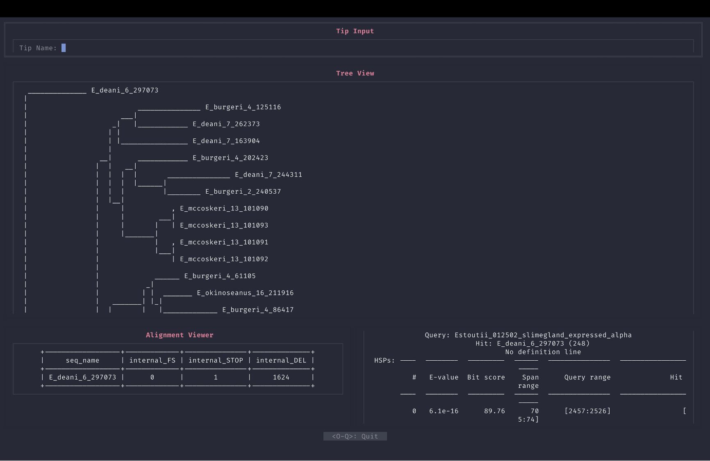

# KaleView

### A Phylogenetic Tree Viewer/ Results Dashboard in the Terminal

### Shows:
- a phylogenetic tree
- blast results of branch tip sequences
- alignment stats of branch tip sequences

### Instructions
- to run the pipeline as setup for the visualizations, run `pipeline.py`
- to run the visualization program, run `KaleView.py`
  - you can run an example fileset by using the files [here](./example_files)
- to view final presentation of the project, go [here](./helper_files/Bioinformatics_Final_Presentation.pptx)

### Example Image

